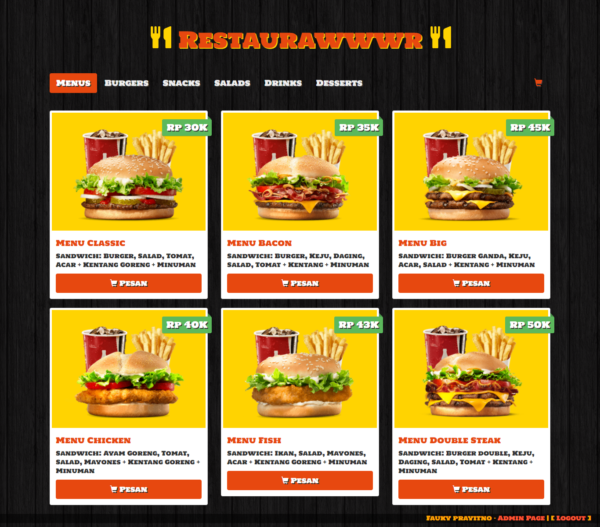
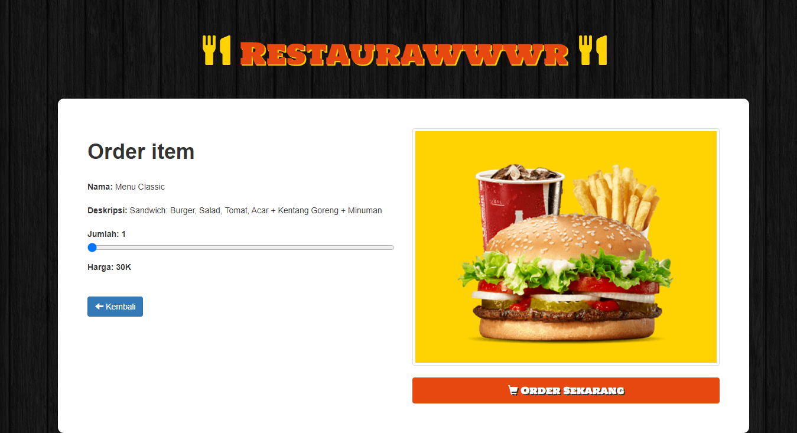
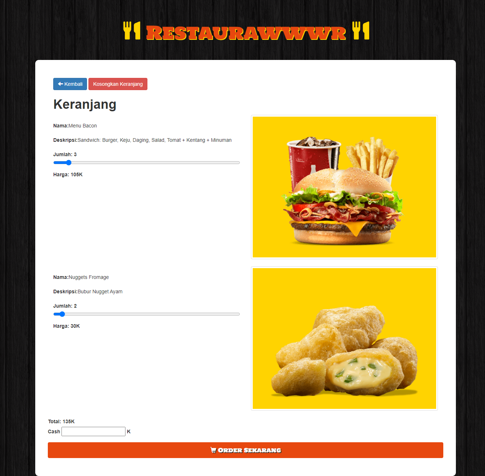
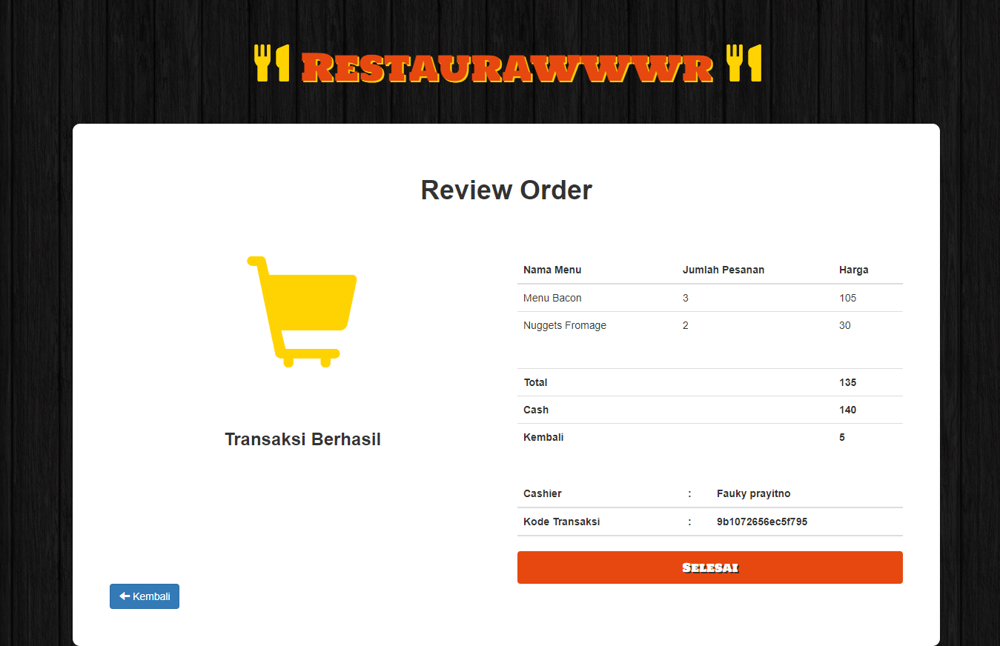
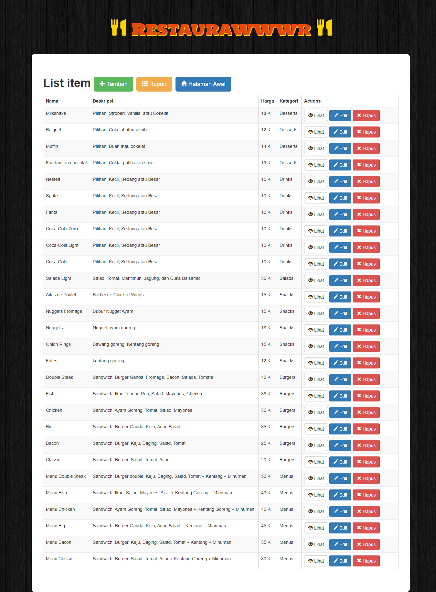
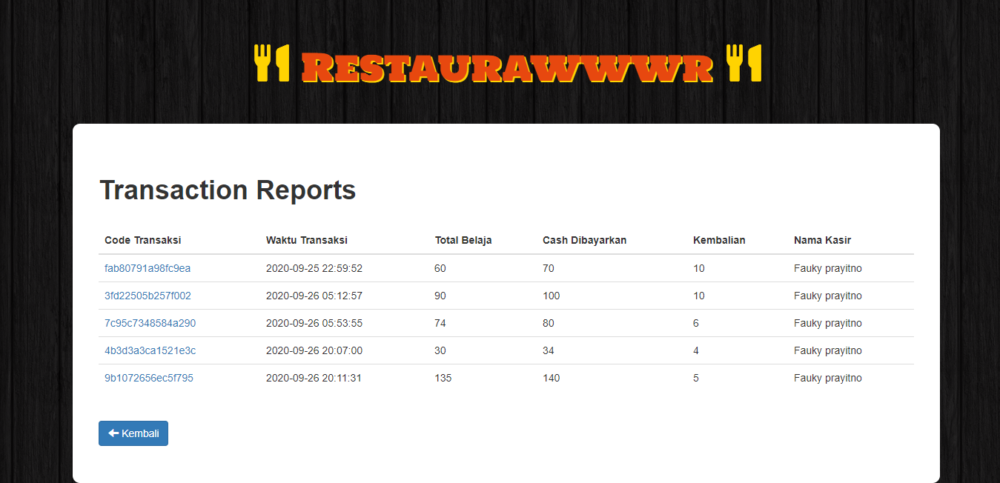

# **Restaurawwwr**

this is just a simple fast food restaurant system, 

the original source is [here](https://github.com/thamoui/burgerCode).

- added basic *"user"* or employees registration and login

- added cart for ordering menu

- added transactions and reports for admin to review

## Screenshots

Home Page

Order Page

Cart Page

Review Order Page

Admin Home Page

Admin Transaction Reports Page

